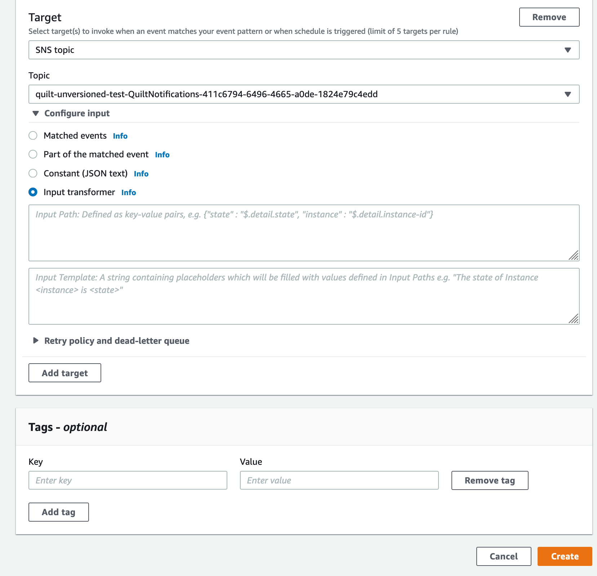

# Using Quilt with other services that consume S3 events

By default, when you connect a bucket to Quilt, Quilt will create an S3
"Event Notification" that forwards events to SNS (and ultimately to SQS and Lambda)
so that Quilt can keep its managed ElasticSearch up-to-date regarding changes
to the underlying bucket.

## The conflict 
As of this writing S3 does not permit overlapping S3 event notifications.
As such, services such as FSx and Quilt may clash.

## The workarounds

1. Provide Quilt with an SNS topic that receives ObjectRemoved:* and ObjectCreated:*
from S3
1. Use EventBridge to generate synthetic S3 events
1. Avoid using S3 notifications by spinning resources (e.g. FSx clusters) up 
"just in time" to avoid the need for live notification from S3

## EventBridge workaround

Suppose you wish to add the bucket `Bucket` to Quilt and use `Bucket` with FSx "always on".
FSx will consume the S3 event notifications. So you can use EventBridge to send
similar notifications to Quilt, thus circumventing the need for Quilt to rely 
directly on S3 event notifications.

You may of course script the following steps. See

1. Create an SNS topic in the same region as `Bucket` 
1. Add `Bucket` to the appropriate CloudTrail. For existing Quilt stacks, you will either see a
trail under CloudFormation > YourStack > Resources, or you provided an existing CloudTrail bucket,
part of a pre-existing trail, under CloudFormation > YourStack > Parameters.
1. Create an EventBridge Rule in the same region as `Bucket`
1. Create an Event Pattern using Pre-defined pattern by service > AWS > S3
1. Set Event type to "Specific operation(s)" and select the following:
   * PutObject
   * CopyObject
   * CompleteMultipartUpload
   * DeleteObject
   * DeleteObjects
1. Select "Specific bucket(s) by name" and specify `Bucket`
    
1. Now we specify the event Target. You will target the SNS topic
that you created above.
    
1. Specify the Input transformer as follows:
    #### Input Path
    ```
    {
        "awsRegion": "$.detail.awsRegion",
        "bucketName": "$.detail.requestParameters.bucketName",
        "eventName": "$.detail.eventName",
        "eventTime": "$.detail.eventTime",
        "isDeleteMarker": "$.detail.responseElements.x-amz-delete-marker",
        "key": "$.detail.requestParameters.key",
        "versionId": "$.detail.responseElements.x-amz-version-id"
    }
    ```
    #### Input Template
    ```
    {
        "Records": [
            {
                "awsRegion": <awsRegion>,
                "eventName": <eventName>,
                "eventTime": <eventTime>,
                "s3": {
                    "bucket": {
                        "name": <bucketName>
                    },
                    "object": {
                        "eTag": "",
                        "isDeleteMarker": <isDeleteMarker>,
                        "key": <key>,
                        "versionId": <versionId>
                    }
                }
            }
        ]
    }
    ```
1. Save the Rule.
1. In the Quilt Admin Panel, under Buckets, add `Bucket` and/or set the SNS Topic
ARN under "Indexing and notifications". 
    
    Now Quilt will receive events directly from EventBridge and does not require S3 event notifications.
1. Re-index the bucket using the Re-Index and Repair button, but be sure **not** to check the Repair checkbox, as this would attempt to create a new S3 event notification.

### Known issues (EventBridge)

1. As of this writing, the `delete-objects` API, which is also invoked when deleting objects with AWS console, is not compatible with the EventBridge workaround.
Unlike native S3 events, `delete-objects` does not generate individual
`delete-object` notifications for each object that has been deleted.


### Known issues (General)

1. Object lifecycle deletes are neither supported by S3 Events nor Quilt per
[AWS Supported Event Types](https://docs.aws.amazon.com/AmazonS3/latest/userguide/notification-how-to-event-types-and-destinations.title.html)

    > You do not receive event notifications from automatic deletes from lifecycle policies
    > or from failed operations.

    Furthermore per
    [Lifecycle and Logging](https://docs.aws.amazon.com/AmazonS3/latest/userguide/lifecycle-and-other-bucket-config.html#lifecycle-general-considerations-logging):
    >  Amazon S3 Lifecycle actions are not captured by AWS CloudTrail object level
    > logging. CloudTrail captures API requests made to external Amazon S3 endpoints,
    > whereas S3 Lifecycle actions are performed using internal Amazon S3 endpoints.
